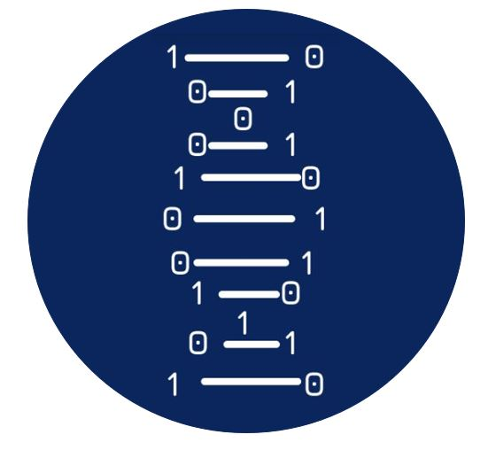

<h1>Hi there! Welcome to the Finnish Society for Bioinformatics</h1>

The Finnish Society for Bioinformatics is for everyone interested in bioinformatics. Whether you're an experienced researcher, an early-career student, a research group, or a company, we warmly welcome you to join our community. And you don't have to be a bioinformatician as long as you think bioinformatics is as cool as we think it is!

<a class="follow-button" href="https://www.linkedin.com/company/finnish-society-for-bioinformatics">Follow us on LinkedIn!</a>

<figure><figcaption>Fri, Feb 7, 2025 @ 18  <strong>Turku</strong>: Saaristobaari, Aurakatu 14, Turku.</figcaption>
</figure>

