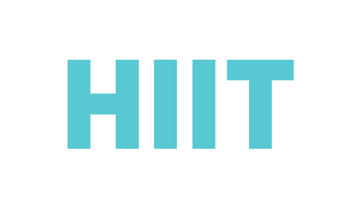

::: {.text-center}
# Bioinformatics Day 2026

## Finland’s largest free Bioinformatics Conference

::: {.fs-2}
In collaboration with:
:::

:::

:::: {.grid .align-items-center .mt-3}

::: {.g-col-6 .g-col-md-4 .g-col-lg-2 .text-center}
{.img-fluid}
:::

::: {.g-col-6 .g-col-md-4 .g-col-lg-2 .text-center}
{.img-fluid}
:::

::: {.g-col-6 .g-col-md-4 .g-col-lg-2 .text-center}
{.img-fluid}
:::

::: {.g-col-6 .g-col-md-4 .g-col-lg-2 .text-center}
{.img-fluid}
:::

::: {.g-col-6 .g-col-md-4 .g-col-lg-2 .text-center}

:::

::::

## 29th of May 2026 in Espoo. {.text-center}

::: {.fs-3}
The 20th Anniversary of the Bioinformatics days

Just as exactly 20 years ago, The Finnish Society for Bioinformatics and CSC –
IT Center for Science, Elixir, HIIT, HiLIFE and Switch Point Bio proudly joined
forces to organize the Bioinformatics day 2026. We had 3 Keynote speakers, 7
talks selected from abstract, 3 poster session, countless networking
opportunities and so much fun! See the highlights below:


:::
