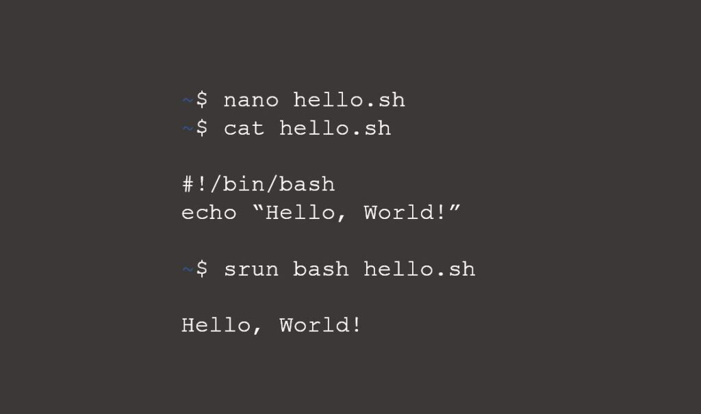

::::: {.grid}

<!-- First event -->

:::: {.g-col-12 .g-col-md-6}
{.img-fluid}
::::

:::: {.g-col-12 .g-col-md-6}

<!-- {.mt-0} is needed to align the image with the title-->
## The BioBeers {.mt-0}

BioBeers are local and casual Bioinformaticians get-togethers. Helsinki
BioBeers are usually on the first Thursday of the month, Turku BioBeers
are on the first Friday of the month.

<!-- BioEvenings start at 18.-->

**Turku** – On a summer break: Next in autumn 2026

**Helsinki** – On a summer break: Next in autumn 2026

**Tampere** – On a summer break: Next in autumn 2026

Helsinki BioBeers aims to try different restaurants and bars at each
BioBeer. Suggest a place for the next Helsinki BioBeer
[**here**](https://link.webropolsurveys.com/S/54EAE005F8199416).

::::

<!-- Second event -->

:::: {.g-col-12 .g-col-md-6 .text-center}
{.img-fluid}
::::

:::: {.g-col-12 .g-col-md-6}

## The BioWebinar {.mt-0}

On a summer break: Next in autumn 2026

**Speaker**: To be announced

**Topic**: To be announced

**Abstract**: To be announced

[Join the webinar](https://utu.zoom.us/my/finnish.bioinformatics.society.webinar){.btn .btn-dark .rounded-pill target="_blank"}

::::

<!-- Third event -->

:::: {.g-col-12 .g-col-md-6}
{.img-fluid}
::::

:::: {.g-col-12 .g-col-md-6}

## The Beginners Bioinformatics “Chat and Code” in Turku {.mt-0}

**NEXT: AUTUMN**

The Finnish Society for Bioinformatics is excited to host beginners
Bioinformatics chat and code event to learn the basics of coding in
collaboration with InFlames Research Flagship and CompLifeSci in Turku.

The beginners Bioinformatics hackathon is aimed for everyone interested in
Bioinformatics – no prior coding experience is needed. The chat and code events
are low threshold, fun events to get everyone as excited of bioinformatics as
we are. We will cover topics like command line, Git, workflows, and even
containers.

No registration needed, just appear in BioCity 4th floor seminar room and bring
your laptop, you might end up writing your first line of code!

::::

<!-- Use the template below to add the webinar with the collapsible abstract -->

<!-- :::: {.g-col-12 .g-col-md-6} -->

<!-- ## Bioinformatics Webinar

<!-- **Thursday, 6 March 2025 at 14:00**

<!-- **Next events:** 8 April, 15 May, and 3 June

<!-- **Topic:** KMAP: Kmer Manifold Approximation and Projection for visualizing DNA sequences

<!-- ::: {.callout-note collapse="true"}
<!-- ## Abstract

<!-- Identifying and illustrating patterns in DNA sequences is a crucial task in -->
<!-- various biological data analyses. In this task, patterns are often represented -->
<!-- by sets of kmers, the fundamental building blocks of DNA sequences. -->

<!-- To visually unveil these patterns, we could project each kmer onto a point in -->
<!-- two-dimensional space. However, this projection poses challenges due to the -->
<!-- high-dimensional nature of kmers and their unique mathematical properties. -->
<!---->
<!-- Here, we established a mathematical system to address the peculiarities of the -->
<!-- kmer manifold. Leveraging this kmer manifold theory, we developed a statistical -->
<!-- method named KMAP for detecting kmer patterns and visualizing them in -->
<!-- two-dimensional space. -->
<!---->
<!-- We applied KMAP to three distinct datasets to showcase its utility. KMAP -->
<!-- achieved performance comparable to the classical method MEME, with -->
<!-- approximately 90% similarity in motif discovery from HT-SELEX data. -->
<!---->
<!-- In the analysis of H3K27ac ChIP-seq data from Ewing Sarcoma, we found that -->
<!-- BACH1, OTX2, and ERG1 might affect prognosis by binding to promoter and -->
<!-- enhancer regions across the genome. We also found that FLI1 bound to enhancer -->
<!-- regions after ETV6 degradation, showing competitive binding between ETV6 and -->
<!-- FLI1. -->
<!---->
<!-- Moreover, KMAP identified four prevalent patterns in gene-editing data from the -->
<!-- AAVS1 locus, aligning with findings reported in the literature. -->
<!---->
<!-- These applications underscore that KMAP could be a valuable tool across various -->
<!-- biological contexts. -->
<!-- ::: -->
<!-- :::: -->

:::::

::: {.text-center .mt-5}
## Frequently Asked Questions
:::

::::: {.grid}

:::: {.g-col-12 .g-col-md-6}

### What is The BioEvening about?

We organize BioEvening to offer Bioinformaticians and everyone interested in
Bioinformatics a possibility to network with like-minded people. Its a great
opportunity to talk about bioinformatics or just come an meet new people and
old friends. BioEvening events are organized every first Friday of the month in
Turku and every first Thursday of the month in Helsinki.
::::

:::: {.g-col-12 .g-col-md-6}

### What are the BioWebinars about?

We organize BioWebinars for our members and for everyone interested
in Bioinformatics as part of our goal to support bioinformatics research, share
the latest scientific discoveries, and provide opportunities for exchanging
ideas and knowledge, thus spread open knowledge in bioinformatics.
::::

:::: {.g-col-12 .g-col-md-6}

### Do I get free food and drinks at the BioEvening events?

Unfortunately the society cannot (afford to) offer free food and drinks at the
BioEvenings. However, in Turku BioEvenings Bioinformaticans get a nice discount
for the foods and drinks at Saaristobaari. Also, it is not required to buy
anything at the BioEvening events, just come along to meet like minded people!
And there is always free water available at the restaurants and bars.
::::

:::: {.g-col-12 .g-col-md-6}

### Who are can participate the webinar?

The webinar is aimed for all bioinformaticians and everyone interested in
bioinformatics. If you know someone interested in bioinformatics or in the
topic of a specific webinar, you can share the webinar link with them. Our
webinar link is always the same.

[Join the webinar](https://utu.zoom.us/my/finnish.bioinformatics.society.webinar){.btn .btn-dark .rounded-pill target="_blank"}
::::

:::: {.g-col-12 .g-col-md-6}

### Why there is no BioEvening event in my town?

Currently we organize BioEvening events only in Turku, Helsinki, and Tampere
because of more active Bioinformatics community in these cities. If you would
like to start organize BioEvening events in your town, please contact us by
email: [fsfbioinf@gmail.com](mailto:fsfbioinf@gmail.com) and we will help you
with everything to set up the events!
::::

:::: {.g-col-12 .g-col-md-6}

### How do you select your speakers?

We aim to have variety in our speakers so they from all career stages,
different fields of bioinformatics and from all corners of the world. For
late-career stage researcher we have reserved a full hour of presentation and
questions (usually 45+15 minutes), while two younger researchers often share
one webinar (25+5 minutes each).
::::

:::: {.g-col-12 .g-col-md-6}

### Why the Turku BioEvening is always in the same restaurant while in Helsinki the place is always different?

Bioinformaticians in Turku prefer Saaristobaari because of its size, games, and
karaoke booth.

Because we enjoy Saaristobaari so much—and they enjoy hosting us—we receive a
dThe Bioinformaticians in Turku prefer Saaristobaari, due to its size, games
and even a karaoke booth. Due to the fact that we love Saaristobaari so much
(and they love us) we get a nice discount for food and drinks during the
BioEvening events. The Bioinformaticians in Helsinki on the other hand are more
adventurous and they prefer to test new restaurants every time to keep things
exciting. If you know a restaurant or a bar in Helsinki that we should
definitely try out at our BioEvening events, you can suggest it
[here](https://link.webropolsurveys.com/S/54EAE005F8199416iscount).
::::

:::: {.g-col-12 .g-col-md-6}

### How can I present my work at the BioWebinar?

We would be thrilled to hear about your work in our Bioinformatics webinars! If
you would like to present your work at the Bioinformatics webinar, please
contact us by email [fsfbioinf@gmail.com](mailto:fsfbioinf@gmail.com) and we
will try to get your talk lined up for the next available slot.
::::

:::::

