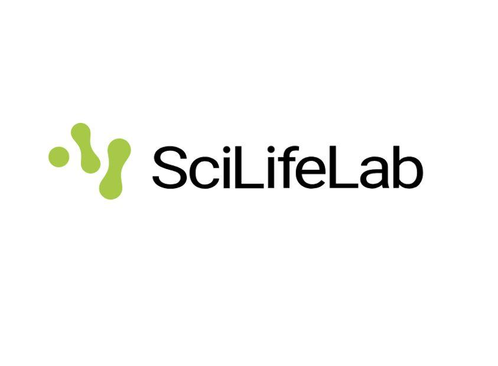

## Open Bioinformatics Positions

::::: {.grid}
<!-- Small screens: one listing -->
<!-- Medium screens: two listings -->
<!-- Large screens: three listings -->

:::: {.g-col-12 .g-col-md-6 .g-col-lg-4 .d-flex .flex-column}

{.img-fluid}

### Postdoctoral funding opportunities at SciLifeLab in Sweden

**The call opens on 7 January 2025.**

Candidates are eligible to apply if they:

- Have not been in Sweden for more than 12 months during the past three years
- Received their PhD less than three years ago

SciLifeLab provides a matchmaking portfolio to help candidates find a suitable research group for their project.

[Read more and apply](https://www.scilifelab.se/research/pulse/application/){.btn .btn-dark .rounded-pill}

::::

:::: {.g-col-12 .g-col-md-6 .g-col-lg-4 .d-flex .flex-column}

{.img-fluid}

### Lectureship in Bioinformatics at the University of Skövde, Sweden

**The application deadline is 6 January 2025.**

The lecturer position primarily involves teaching bioinformatics and handling
the administration associated with these duties.

The position may also include additional responsibilities.

::::

:::: {.g-col-12 .g-col-md-6 .g-col-lg-4 .d-flex .flex-column}

{.img-fluid}

### Would you like to advertise an open position here?

Reach bioinformaticians where they are and find the best candidates in the field.

Send us information about your open position, and we will add it to this page.

[Contact us](mailto:fsfbioinf@gmail.com){.btn .btn-dark .rounded-pill}

::::

:::::
